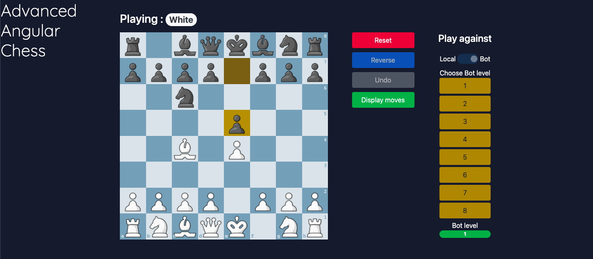
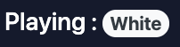
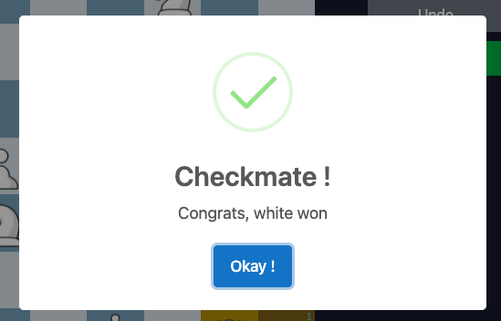
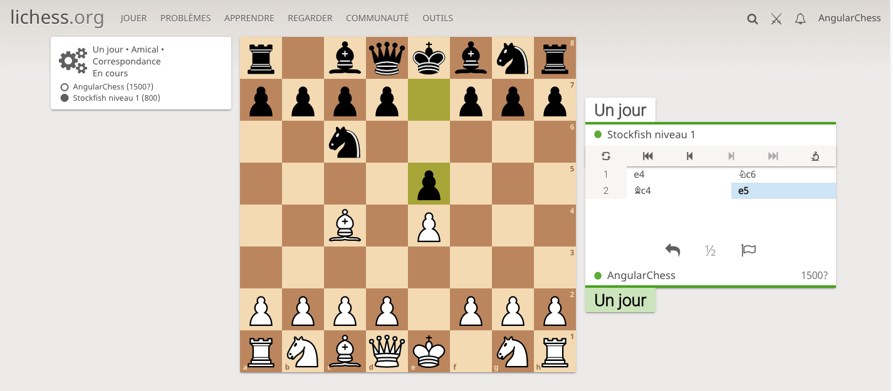

   # Advanced Angular Chess

   Ce projet "Advanced Angular Chess" est un projet développé par Perig Cossec--Kerloc'h, Maugan Le Rhun et Vincent dans le cadre du cours de JXC.

   Nous avons choisis de travailler sur un échiquier en ligne car c'est un sujet que nous apprécions tous les trois et nous avons l'habitude de jouer sur la référence du sujet : chess.com. Aussi, nous avons choisis de travailler avec la technologie Angular, c'est la seule que nous maitrisons tous correctement, Perig et Maugan étant plus spécialisé React et Vincent sur le côté VueJS.

   Comme demandé pour ce cours, nous sommes parti d'un projet existant, trouvé sur github qui nous permettait de le mettre en place et d'y ajouter des fonctionnalités, notre projet est donc basé sur le projet [ngx-chess-board](https://grzegorz103.github.io/ngx-chess-board/chess-board/index.html) qui vise à proposer une implémentation d'un échiquier pour 2 joueur pour les sites web.

   ## Demo
   Voir la  [version demo](https://grzegorz103.github.io/ngx-chess-board/chess-board/index.html) du projet de départ.


   ## Installation d'Advanced Angular Chess
   Installation des dépendances
   ```bash
   npm i ngx-chess-board
   ```
   -> Ajouter --force afin d'éviter que les vulnérabilités du projet ne bloque pas l'installation si besoin.

   Lancement de l'échiquier
   ```bash
   npm i ngx-chess-board
   ```

   L'échiquier seras ensuite disponible sur votre [localhost](http://localhost:8080/).

   ## Fonctionnalités ajoutées

   Nous nous sommes au début un peu marché sur les pieds, implementant la même feature sans se parler, aussi nous avons par la suite travaillé à l'aide de branche sur github afin d'être sur que cela n'arrive pas une seconde fois.

   ### Nouvelle interface

   Nous avons commencé par vérifier le bon lancement du projet, l'implémentation de base est disponible sur ce repository sous le tag v0.0. Ensuite nous avons choisis de modifier l'interface utilisateur car nous ne la trouvions pas à notre gout et étions convaincu de pouvoir faire quelque chose de plus esthetique. Nous avons donc défini une nouvelle interface pour la page et l'échiquier en travaillant sur le style des différents éléments.

   

   ### A qui le tour ?

   Nous avons continué en ajoutant un badge bootstrap indiquant quelle est la couleur qui doit jouer.

   

   ### Modal de fin

   Lors de la fin d'une partie avec l'implémentation de base, le composant indique au site la fin mais rien ne se passait, nous avons choisis de mettre en place des modals à l'aide de sweetAlert afin de notifier d'un échec et mate ou d'un stalemate.

   

   ### Les actions des joueurs

   // TODO PERIG

   ## Chess BOT

   L'ajout majeur que nous avons apporté sur le projet est la possibilité de pouvoir jouer à la fois en local à 2 joueurs sur le site, mais également de jouer avec un BOT. Pour cela, nous avons fais appel à un site d'échec ayant une API public nous permettant de le faire : Lichess.org. Cet API nous permet de jouer des parties avec [stockfish](https://fr.wikipedia.org/wiki/Stockfish_(programme_d%27%C3%A9checs)) en définissant le niveau du bot au début de la partie. Nous allons préciser comment s'est passé cette implémentation.

   ### Interaction avec l'API

   Afin de pouvoir intéragir avec l'API, il a été nécessaire de créer un profil utilisateur sur le site. Puis d'aller dans les paramètre afin de générer un token d'authentification, que nous utilisons pour nous identifier auprès de l'API, il est pour l'instant en dur dans le code. Une fois cela fais, la communication passait plus ou moins mais les réponses étaient bizarres avec parfois des blocages liés au CORS, ce qui ne semble pas normal pour une API public avec authentification. Après plusieurs heures d'experimentation, nous avons compris que le problème venait du port que d'ou venais notre requete, de base, angular se lançait sur un port non authorisé pour appeler l'API, nous l'avons donc précisé à 8080, et nous avons pu correctement interagir avec le serveur.

   ### Début d'une partie

   Au début d'une partie, nous faisons une requete de challenge au bot Lichess, en précisant le temps de jeu de chacun (1 jour pour ne pas avoir de problème lié à cela), la couleur de notre côté et le niveau du bot entre 1 (environ 800 élo, un niveau de joueur débutant) à 8 (environ 3000 élo, un niveau plus élevé que le champion du monde). Cela crée une partie sur notre compte Lichess, afin d'éviter les problèmes, nous désactivons les boutons n'étant pas utiles comme retourner l'échiquier, changer de niveau du bot ou revenir en arrière d'un moove.

   Avec notre mécanisme, nous pouvons suivre en parrallèle de sur notre projet, la même partie du côté Lichess.

   
   

   ### Faire un moove

   Faire un moove a été la partie la plus difficile à implementer, en effet, il faut recevoir le moove fait par le joueur et l'envoyer à l'API pour qu'il puisse calculer et jouer son prochain coup. Nous avons donc cherché à envoyer une première requête pour envoyer le coup joué et quelques secondes ensuites récuperer le coup du BOT. 

   Pour récuperer le coup du BOT, nous avons choisis d'utiliser une requete API qui récupère toutes les parties joués par le compte lichess et à l'aide de l'id de la partie récuperer lors du début de la partie, nous retrouvons la bonne partie et regardons quel est le dernier coup joué de cette partie. Nous avons du faire cela, car il existe bien une partie de l'api pour récuperer toutes les informations d'une partie mais celle ci est beaucoup moin performante et prend environ 25 secondes à s'executer, nous avons donc choisi cette approche non conventionnelle mais plus performante suite à différents tests.

   ### Clore la partie

   Lors d'un reset, nous avons forcé la fermeture de toutes les parties du compte lichess en les faisant abandonner afin de nettoyer et d'éviter d'avoir des centaines de parties en cours et non fini sur le compte.


   ### Problèmes rencontrés

   Nous avons rencontrés quelques problèmes lors de l'implémentation du BOT, niveau authentification auprès de l'API avec le port comme expliqué auparavant, mais pas la suite, nous avons observé qu'apèrs une 15 de coups joués contre le BOT, la partie s'arretait et cela car nous recevions notre propre coups comme dernier coup joué. Afin de limiter ce problème, nous sommes passés d'une attente de 3 secondes avant de récuperer le coup du bot à 8 afin de lui laisser le temps de calculer et donner son coup et un mécanisme pour réessayer si le dernier coup joué est le notre.
   Aussi la mécanique de roque n'est pas décrit pareil en terme de coup entre notre composant et la réponse de lichess, nous avons donc utilisé simplement un switch case pour solutionner cela.

   ## Conclusion

   Nous avons apprecié faire ce projet grace à la liberté qu'il nous a été donné de travailler sur un projet qui nous intéressait vraiment. Et sommes plutot fier du résultat de notre projet en Angular que vous pouvez retrouver sous les tag v1.0 et lancer localement.


